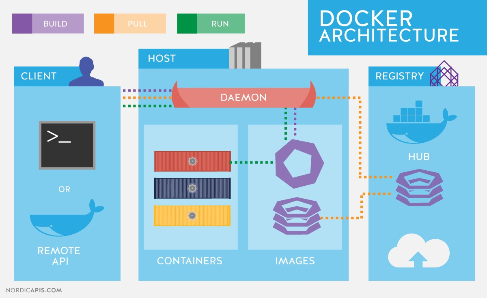
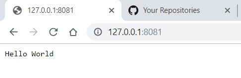
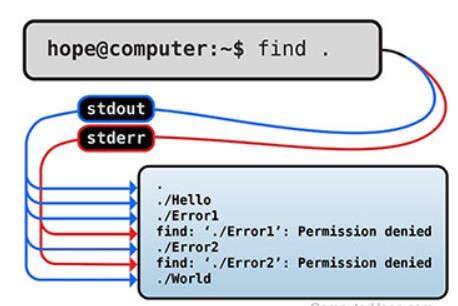

# M300-Services
Dokumentation für das Modul 300

## Inhaltsvverzeichnis
* Einleitung - [Einleitung](#einleitung)
* 01 - [K1](#k1)
* 02 - [K2](#k2)
* 03 - [K3](#k3)
* 04 - [K4](#k4)
* 05 - [K5](#k5)

## Einleitung
Vieles wird hier automatisiert mit Hilfe von einem Vagrantfile und unterschiedlichen Scripts. Die Files können oben in der Sammlung betrachtet werden. 

## K1
K1 wurde mit der LB2 bereits erledigt und kann
[hier](https://github.com/GuitAris/M300-Services/tree/master/lb2#k1) genauer betrachtet werden.

## K2
Meine Dokumentation über Git habe ich bereits [hier](https://github.com/GuitAris/M300-Services/tree/master/lb2#k2) dokumentiert. 
### Wissensstand
Ich besuche jeweils Mitwochs das Wahlmodul 901 und habe dort schon einiges über Docker gehört. Einzelte Arbeiten konnte ich auch schon mit Docker machen, sehe mich aber, bezüglich des Wissensstands, als Anfänger. Einen Microservice habe ich auch mal erstellt. Der Microservice den ich erstellt habe, hatte eine Website mit "Hello World" gezeigt. 

## K3
### Kennt die Docker spezifischen Befehle
**Was ist Docker?**

Mit Docker kann man vereinfacht Container bereitstellen und installieren. 

**Docker Befehle**

| Command | Bedeutung |
| ---- | ---- |
| docker build "Source" | Erstellt ein Docker image | 
| docker images | Zeigt alle verfügbare Docker images |
| docker rmi "image" | Löscht ein Docker image |
| docker run "image" | startet ein Docker image |
| docker exec -it "Container" \bin\bash | Exploriert einen Container |

### bestehende Container als Backend, Desktop-App als Frontend
In diesem Fall habe ich beispielsweise einen Micro-Service, der im Backend also auf der VM mittel Container gestartet wird. Im Frontend habe ich eine Website die mir "Helo World" zeigt.

### Volumen zur persistenten Datenablage eingerichtet
Alle meine Scripts werden zentral in einem Ordner und weitere Unterordner,die vom Namen selbsterklärend sind, gespeiercht. So wird beim ausführen von Vagrant auch immer gleich noch vierschiedene weitere Scripts mit ausgeführt. 

### Funktionsweise getestet inkl. Dokumentation der Testfälle
Die Funktionsweise habe ich auf unterschiedlichen Arten getestet. So habe ich beispielsweise bei meinem Microservice geschaut, ob ich die Seite erreichen kann. Oder beim Reverse-Proxy ob die Seiten richtig weitergeleietet werden. 
### Testfälle
Ist Docker überhaupt installiert?

    docker --version

Wurde das Docker-Volumen erstellt?

    docker container list

Kann ich auf meine Dienste zugreifen?

Im Browser localhost öffnen mit z.B. Port 8080

    localhost:8080

Sind die FireWall Ports offen?

    sudo ufw status

### Sicherheitsaspekte
Für die Sicherheitsaspekte werden kann man Gruppen erstellen und die jeweiligen Gruppen oder Personen berechtigen. So kann man z.B. definieren,dass ein User einen bestimmten Conatiner anpassen darf. Auch wurden Port weiterleitungen erstellt. So muss man nicht direkt auf den Dockercontainer sondern kann das beispielsweise über das Web machen. 
Vieles wird bei mir über ein script gemacht. Beispielsweise die Firewallrules oder einen neuen Benutzer erstellen.

    #firewall installieren
    sudo apt-get -y install ufw

    #firewall starten
    sudo ufw --force enable

    #Port 80 öffnen für alle
    sudo ufw allow 80/tcp

    #Port 22 öffnen für alle
    sudo ufw allow 22/tcp

    # HTTPS
    sudo ufw allow 443
    #ghost
    sudo ufw allow 2368

    # Jenkins, Ghost, Microservice
    sudo ufw allow 8080
    sudo ufw allow 8082
    sudo ufw allow 50000
    sudo ufw allow 8081

    # Allow a range of Firewall rules for Jenkins
    for i in {32760..32780}
    do
        sudo ufw allow $i
    done

### Netzwerkplan

+------------------------------------------------------------------------------------------------+
| Netzwerk: 10.0.2.0/24                                                                          |
|+----------------------------------------------------------------------------------------------+|
|| Hostname: ch-web01                                                                           ||
|| OS: Ubunt  16.04 LTS                                                                         ||
||                                                                                              ||
|| LAN enp3s0: 10.0.2.15                                                                        ||
|| Docker docker0: 172.17.0.1                                                                   ||
|| Port: 80, 443, 8080, 8082                                                                    ||
|| NAT: 32760-32780, 80, 8080, 8081, 8082, 3306, 2368                                           ||
||                                                                                              ||
|| +-----------------------------------------+      +-----------------------------------------+ ||
|| | Ghost Container                       |      | Apache Container                        | ||
|| | Ports: 8080, 2368                       |      | Ports: 80, 443, 8081                    | ||
|| | Version: 2.60.3                         |      | Version: 14.04                          | ||
|| | Plugins: git-client, docker-engine      |      | Plugins: -                              | ||
|| |                                         |      |                                         | ||
|| |                                         |      |                                         | ||
|| +-----------------------------------------+      +-----------------------------------------+ ||
|+----------------------------------------------------------------------------------------------+|        |                                                                                                |
|+----------------------------------------------------------------------------------------------+|
|| Hostname: ch-db01                                                                            ||
|| OS: Ubunt  16.04 LTS                                                                         ||
||                                                                                              ||
|| LAN enp3s0: 10.0.2.16                                                                        ||
|| Docker docker0: 172.17.0.2                                                                   ||
|| Port: 80, 443, 3306                                                                          ||
|| NAT: 32760-32780, 80, 8080, 8081, 8082, 3306,                                                ||
||                                                                                              ||
|| 
|+----------------------------------------------------------------------------------------------+|
+------------------------------------------------------------------------------------------------+

## K4
### Service-überwachung ist eingerichet

Um Docker Container zu überwachen, muss man nicht viel einrichten, denn Docker bringt schon selbst eine Möglichkeit mit, Services zu überwachen. 

    docker ps
Somit werden die laufenden Docker-Container angezeigt. Man erhält somit rasch einen Überblick was läuft und was nicht.

    docker run <ID>
Gitb man das ein, erhält man die Informationen, welcher Service auf dem Container läuft. Ich habe das mal bei einem Container gemacht und erhalte folgende Antwort. 
    
    Server running at http://127.0.0.1:8081/

**stderr**
Ist der Standarderror in Unix. Dort schreibt ein Prozess seine Fehlermeldungen. 

**stdout**
Das ist der Standard File-Descriptor, welcher ein Prozess verwendet um einen Output zu schreiben. 

### Microservice
**Was ist ein Mikroprozess?**

Ein Mikroprozess ist ein einzelner Prozess eines grossen Ganzen. Mikroprozese ändern das Vorgehen, wie Programme geschrieben werden. Mit Mikroprozesse braucht es nicht mehr ein grosses Porgramm, dass alles kann, sondern man teilt dieses grosse Programm in einzelnen kleinen Dienste. Somit kann man eine bessere Belastung und eine höhre Erreichbarkeit erzielen. 

**Beispiel eines Mikroprezess**
Folgend zeige ich einen einfachen Mikroprozess. Damit dieser ausgeführt werde kann muss noch Node Js installiert werden. 

    var http = require("http");
    http.createServer(function (request, response) {
    // Send the HTTP header 
    // HTTP Status: 200 : OK
    // Content Type: text/plain
    response.writeHead(200, {'Content-Type': 'text/plain'});
    
    // Send the response body as "Hello World"
    response.end('Hello World\n');
    }).listen(8081);

    // Console will print the message
    console.log('Server running at http://127.0.0.1:8081/');

***

## K5
### Zusammenfassung
Da unter K5 verschiedene Punkte zusammengefasst werden könne, schreibe ich deshalb nur einen Text ohne viele Titel und Kapitel.
Durch diese LB3 konnte ich mich noch tiefer mit der Materia versetzten. Ich finde es prima, dass wir so etwas in der Schule anschauen. Gerade jetzt bin ich bei der Arbeit im Automation-Team, welches ebenfalls mit Docker und Kubernetes arbeitet. Ich denke durch diese LB3 habe ich einiges über Docker und andere Produkte gelernt. Im Vergleich was ich zu Beginn wusste und was ich nun weiss, habe sehr vieles dazu gelernt. 
## K6
### Elemente aus Kubernetesübung sind dokumentiert
In Kubernetes gibt es immer mindestens einen Master und einen Worker.
Die Kuebernetesübung kann folgendermassen gemacht werden. 

    #Man wechselt ins Repo
    cd m-300/lernkube
Im *config.yaml* wird definiert ob man einen Master oder einen Worker-Node ist. 

Danach kann die VM mit Vagrant gestartet werden

    vagrant up

Nun bekommt man vom Master-Node einen Token dne man angeben muss.
Schlussendlich kann auf dem Master nun alle Worker-Node überwacht werden. 
 
    kubectl get pots -d

### Continous Integration
Dafür verwende ich Jenkins. Mein Dockerfile für Jenkins sieht folgendermassen aus: 

    FROM jenkinsci/blueocean
    EXPOSE 8080
Ich verwende für Jenskins den Port 8080
Mein Script, welches nach der Erstellung der VM ein Container erstellt, sieht so aus: 

    sudo docker build -t jenkins .
    sudo docker run -d --name jenkins -p 8080:8080 --rm -v /var/run/docker.sock -v /vagrant:/vagrant   jenkins

Auch benötigt Jensinks ein Jenkinsfile, weches folgendermassen aussehen kann. Dieses File ist von Kevin Frunz: 

    
    apiVersion: extensions/v1beta1
    kind: Deployment
    metadata:
    name: jenkins
    namespace: jenkins
    spec:
    replicas: 1
    template:
        metadata:
        labels:
            app: master
        spec:
        containers:
        - name: master
            image: jenkins/jenkins:2.67
            ports:
            - containerPort: 8080
            - containerPort: 50000
            readinessProbe:
            httpGet:
                path: /login
                port: 8080
            periodSeconds: 10
            timeoutSeconds: 5
            successThreshold: 2
            failureThreshold: 5
            env:
            - name: JENKINS_OPTS
            valueFrom:
                secretKeyRef:
                name: jenkins
                key: options
            - name: JAVA_OPTS
            value: '-Xmx1400m'
            volumeMounts:
            - mountPath: /var/jenkins_home
            name: jenkins-home
            resources:
            limits:
                cpu: 500m
                memory: 1500Mi
            requests:
                cpu: 500m
                memory: 1500Mi
        volumes:
        - name: jenkins-home
            gcePersistentDisk:
            pdName: jenkins-home
            fsType: ext4
            partition: 1

### Image bereitstellung
Wird das Vagrantfile ausgeführt, wird neben vielen anderen Sachen auch eine Ubuntu-Image bereitgestellt. 

    # Docker Provisioner (Install image)
    web.vm.provision "docker" do |d|
        d.pull_images "ubuntu:14.04"
    end
